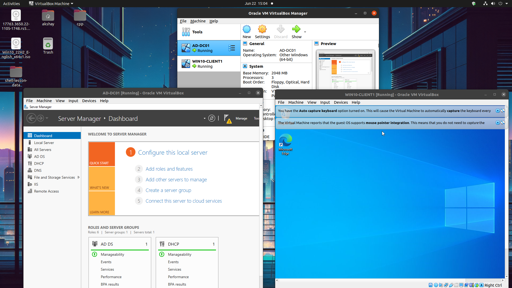
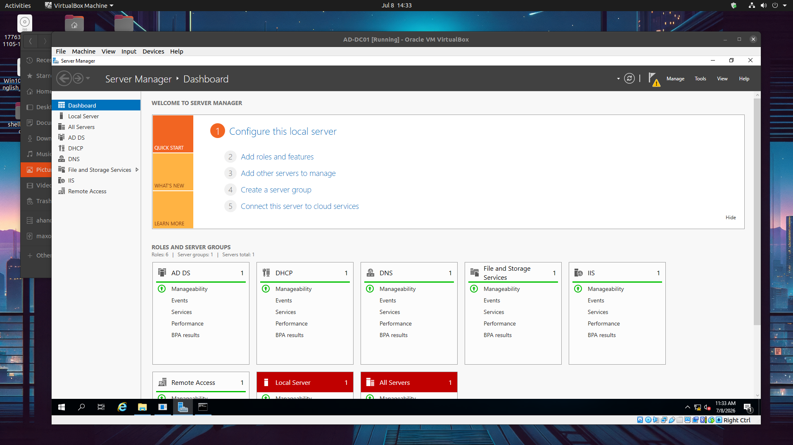
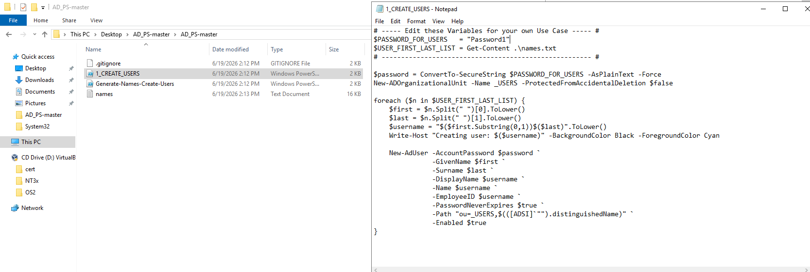
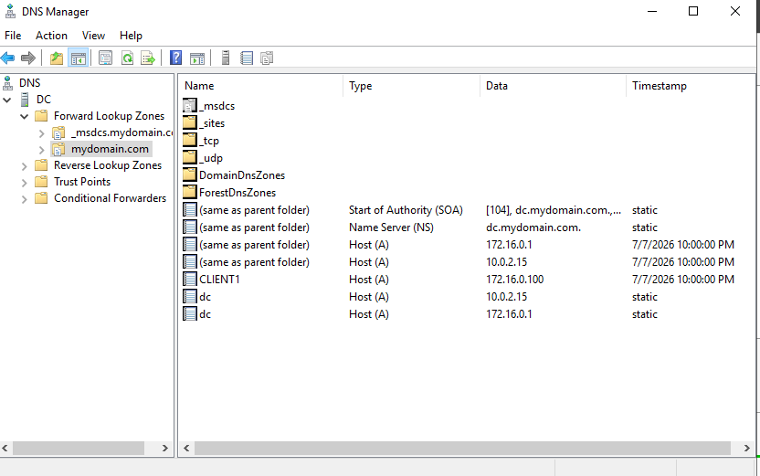
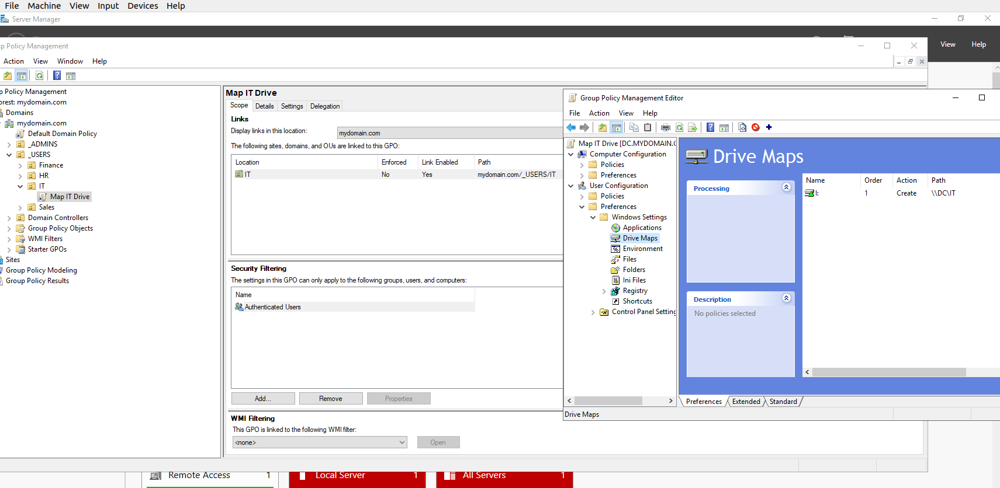

# Enterprise Active Directory Home Lab

An enterprise Windows Server home lab built using **Oracle VirtualBox** on **Ubuntu Linux** to simulate a real-world corporate IT environment. This project demonstrates the deployment and administration of Active Directory Domain Services (AD DS), DNS, DHCP, Routing and Remote Access Services (RRAS), Group Policy, SMB File Sharing, and PowerShell automation.

---

# Project Overview

The goal of this project was to build a fully functional Windows domain environment while gaining hands-on experience with enterprise Windows infrastructure technologies commonly used in Help Desk, Desktop Support, Systems Administration, and IT Infrastructure roles.

The environment includes:

- Windows Server 2022 Domain Controller
- Windows 10 Pro Domain Client
- Active Directory Domain Services (AD DS)
- DNS Server
- DHCP Server
- Routing and Remote Access Services (RRAS) with NAT
- Group Policy Management
- SMB File Sharing
- PowerShell Automation
- Enterprise Network Design

---

# Lab Architecture

## Network Diagram


## Virtual Machine Layout


---

# Environment

| Component | Configuration |
|-----------|---------------|
| Host Operating System | Ubuntu Linux |
| Hypervisor | Oracle VirtualBox |
| Domain Controller | Windows Server 2022 |
| Client | Windows 10 Pro |
| Domain | mydomain.com |
| Internal Network | 172.16.0.0/24 |

---

# Technologies Used

- Windows Server 2022
- Windows 10 Pro
- Active Directory Domain Services (AD DS)
- DNS
- DHCP
- Routing and Remote Access Services (RRAS)
- Network Address Translation (NAT)
- Group Policy
- SMB File Sharing
- NTFS Permissions
- Active Directory Security Groups
- Organizational Units (OUs)
- PowerShell
- Oracle VirtualBox
- Ubuntu Linux

---

# Features Implemented

## Active Directory

- Installed and configured Active Directory Domain Services
- Promoted Windows Server 2022 to a Domain Controller
- Created a new Active Directory forest
- Created Organizational Units (OUs)
- Created Security Groups
- Created and managed domain users
- Joined Windows 10 Pro to the domain

---

## DNS

- Installed DNS Server
- Configured an Active Directory-integrated Forward Lookup Zone
- Verified DNS records
- Configured clients to use the Domain Controller for DNS resolution

---

## DHCP

- Installed DHCP Server
- Created an IPv4 Scope
- Configured Scope Options
- Authorized the DHCP Server
- Verified automatic IP address assignment

---

## Routing & Remote Access (RRAS)

- Installed the Remote Access role
- Configured RRAS with NAT
- Configured Internet and Internal network adapters
- Enabled Windows 10 Pro clients to access the Internet through the Domain Controller

---

## Group Policy

- Created and linked Group Policy Objects
- Configured automatic network drive mapping
- Applied policies to Organizational Units
- Verified policy deployment using:

```
gpupdate /force
gpresult /r
```

---

## File Sharing

- Created SMB network shares
- Configured Share Permissions
- Configured NTFS Permissions
- Controlled access using Security Groups
- Automatically mapped network drives through Group Policy

---

## PowerShell Automation

- Automated bulk Active Directory user creation
- Generated over 1,000 Active Directory users
- Reduced manual administrative tasks through scripting

---

# Project Documentation

Additional documentation is available in the **docs** directory.

- Active Directory
- DNS
- DHCP
- RRAS & NAT
- Group Policy
- File Sharing

---

# Screenshots

## VirtualBox Overview



---

## Server Manager Dashboard



---

## Active Directory


---

## PowerShell Automation



---

## DHCP


---

## DNS



---

## Group Policy




---

## Client Verification


---

# Skills Demonstrated

- Windows Server Administration
- Active Directory Administration
- Windows Networking
- DNS
- DHCP
- RRAS
- NAT
- Group Policy
- Active Directory Security Groups
- Organizational Units
- Windows Authentication
- SMB File Sharing
- NTFS Permissions
- PowerShell Automation
- Enterprise Network Administration
- Troubleshooting
- Virtualization using Oracle VirtualBox

---

# Future Improvements

Planned enhancements include:

- Windows Server Update Services (WSUS)
- Print Server
- Microsoft Deployment Toolkit (MDT)
- Windows Deployment Services (WDS)
- Microsoft Entra ID Integration
- Microsoft Intune
- Microsoft 365 Administration
- pfSense Firewall
- Linux Server Integration

---

# Author

**Akshay H.**

This project was built to strengthen practical Windows Server administration skills and simulate enterprise IT infrastructure commonly found in professional environments.
