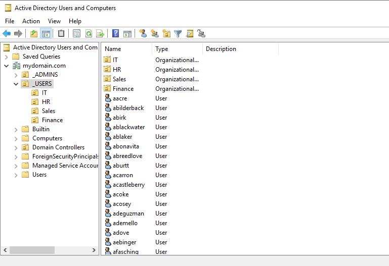

# Active Directory Domain Services (AD DS)

## Overview

This document explains how I configured Active Directory Domain Services (AD DS) in my Windows Server 2022 home lab. Active Directory provides centralized management of users, computers, security groups, and organizational units within the domain.

---

## Environment

| Component | Configuration |
|-----------|---------------|
| Host OS | Ubuntu Linux |
| Hypervisor | Oracle VirtualBox |
| Server | Windows Server 2022 |
| Client | Windows 10 Pro |
| Domain | mydomain.com |
| Domain Controller | DC |

---

## Objectives

The goals of implementing Active Directory were:

- Create a centralized Windows domain
- Manage users and computers
- Organize resources using Organizational Units (OUs)
- Create Security Groups
- Authenticate domain users
- Prepare the environment for Group Policy and shared folders

---

## Configuration Steps

### 1. Installed Active Directory Domain Services

Installed the AD DS server role using Server Manager.

### 2. Promoted the Server to a Domain Controller

Configured the server as a new forest using:

mydomain.com

### 3. Created Organizational Units

Created separate Organizational Units (OUs) for each department:

- IT
- HR
- Finance
- Sales

This allows policies and users to be organized by department.

### 4. Created Security Groups

Created department-based security groups including:

- IT_Users
- HR_Users
- Finance_Users
- Sales_Users

These groups are later used for permissions and Group Policy.

### 5. Created Users

Created domain users and assigned them to the appropriate Organizational Units and Security Groups.

PowerShell automation was later used to bulk-create users.

### 6. Joined Windows 10 Pro to the Domain

Joined the Windows 10 Pro virtual machine to:

mydomain.com

Verified successful domain authentication using domain user credentials.

---

## Verification

Successfully verified:

- Domain Controller operational
- Domain created successfully
- Users authenticated successfully
- Windows 10 Pro joined to the domain
- Organizational Units functioning correctly
- Security Groups created
- Active Directory replication healthy (single DC environment)

---

## Skills Demonstrated

- Active Directory Domain Services (AD DS)
- Windows Server Administration
- Domain Controller Deployment
- User Management
- Organizational Units
- Security Groups
- Domain Authentication
- Windows Client Domain Join

---

## Related Screenshots

- 
- Organizational Units
- Security Groups
- Client Domain Login
