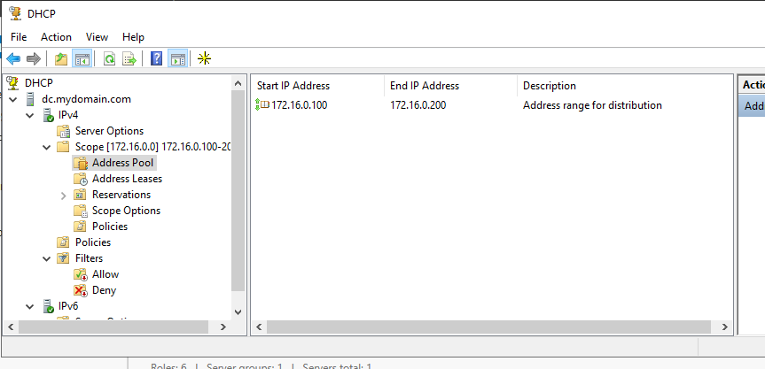
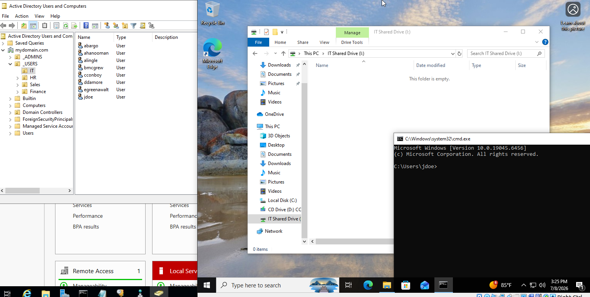

# Dynamic Host Configuration Protocol (DHCP)

## Overview

This document explains how Dynamic Host Configuration Protocol (DHCP) was configured in my Windows Server 2022 Active Directory home lab. DHCP was used to automatically assign IP addresses and network configuration settings to domain clients, eliminating the need for manual IP configuration.

---

## Environment

| Component | Configuration |
|-----------|---------------|
| Domain | mydomain.com |
| Domain Controller | Windows Server 2022 |
| Client | Windows 10 Pro |
| Hypervisor | Oracle VirtualBox |
| Host OS | Ubuntu Linux |

---

## Objectives

The objectives of this implementation were to:

- Deploy a centralized DHCP server
- Automatically assign IP addresses to domain clients
- Configure the default gateway and DNS server
- Simplify network management
- Simulate enterprise network infrastructure

---

## Configuration Steps

### 1. Installed the DHCP Server Role

Installed the DHCP Server role using Server Manager and completed the post-installation configuration.

---

### 2. Created a DHCP Scope

Configured an IPv4 scope for the internal network.

Scope Information:

| Setting | Value |
|---------|-------|
| Network | 172.16.0.0/24 |
| Start Address | 172.16.0.100 |
| End Address | 172.16.0.200 |
| Subnet Mask | 255.255.255.0 |

This scope provides IP addresses to domain clients joining the internal network.

---

### 3. Configured Scope Options

Configured DHCP Scope Options to automatically provide clients with the required network settings.

Configured options included:

- Default Gateway: **172.16.0.1**
- DNS Server: **172.16.0.1**
- DNS Domain Name: **mydomain.com**

These settings allow clients to communicate with the Domain Controller and access Active Directory services.

---

### 4. Authorized the DHCP Server

Authorized the DHCP server within Active Directory to begin leasing IP addresses to clients.

---

## Verification

Successfully verified:

- The DHCP scope was active.
- Windows 10 Pro automatically received an IP address.
- The client received the correct subnet mask.
- The client received the Domain Controller as its default gateway.
- The client received the Domain Controller as its DNS server.
- Network connectivity was successfully established.

The Windows 10 client received:

| Setting | Value |
|---------|-------|
| IP Address | 172.16.0.100 |
| Default Gateway | 172.16.0.1 |
| DNS Server | 172.16.0.1 |

---

## Importance of DHCP

DHCP centralizes IP address management and removes the need to manually configure each client.

In an enterprise environment, DHCP automatically provides:

- IP Address
- Subnet Mask
- Default Gateway
- DNS Server
- Domain Name

This significantly simplifies workstation deployment and reduces configuration errors.

---

## Skills Demonstrated

- Windows Server Administration
- DHCP Server
- IPv4 Scope Configuration
- DHCP Scope Options
- Active Directory Integration
- Enterprise Network Administration
- Windows Client Configuration
- Network Troubleshooting

---

## Related Screenshots

### DHCP Scope

### Windows 10 Client IP Configuration

