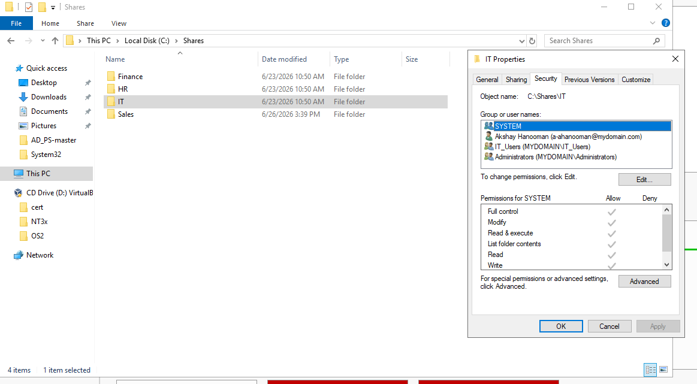

# File Sharing

## Overview

This document explains how file sharing was configured in my Windows Server 2022 Active Directory home lab. Department-specific shared folders were created and secured using both Share Permissions and NTFS Permissions. Access to these resources was controlled through Active Directory Security Groups and automatically mapped to users using Group Policy.

---

## Environment

| Component | Configuration |
|-----------|---------------|
| Domain | mydomain.com |
| Domain Controller | Windows Server 2022 |
| Client | Windows 10 Pro |
| Hypervisor | Oracle VirtualBox |
| Host OS | Ubuntu Linux |

---

## Objectives

The objectives of this implementation were to:

- Create centralized network file shares
- Restrict folder access using Security Groups
- Configure Share Permissions and NTFS Permissions
- Automatically map department drives using Group Policy
- Simulate enterprise file server management

---

## Configuration Steps

### 1. Created Shared Folders

Created department-specific folders on the Domain Controller.

Department folders included:

- IT
- HR
- Finance
- Sales

These folders were configured as SMB network shares.

---

### 2. Configured Share Permissions

Configured Share Permissions to allow access only to the appropriate Active Directory Security Groups.

Example Security Groups:

- IT_Users
- HR_Users
- Finance_Users
- Sales_Users

---

### 3. Configured NTFS Permissions

Configured NTFS Security Permissions on each folder to ensure users could only access their assigned department resources.

Permissions were assigned using Active Directory Security Groups rather than individual user accounts to simplify administration and follow enterprise best practices.

---

### 4. Configured Group Policy Drive Mapping

Configured Group Policy Preferences to automatically map the appropriate shared folder when users logged into the domain.

Drive mapping was configured under:

```text
User Configuration
└── Preferences
    └── Windows Settings
        └── Drive Maps
```

After successful Group Policy processing, users automatically received the appropriate mapped network drive based on their department.

---

## Verification

Successfully verified:

- Shared folders were accessible across the network.
- Authorized users could access their department's shared folder.
- Unauthorized users were denied access.
- Windows 10 Pro automatically mapped the correct network drive after user authentication.
- File sharing functioned successfully across the Active Directory domain.

---

## Troubleshooting

During implementation, the mapped network drive did not initially appear on the Windows 10 Pro client.

The following troubleshooting steps were performed:

- Verified the Windows 10 client successfully joined the domain.
- Confirmed the user account belonged to the correct Active Directory Security Group.
- Verified the shared folder path.
- Verified both Share Permissions and NTFS Permissions.
- Ran `gpupdate /force` to refresh Group Policy.
- Used `gpresult /r` to verify that the Group Policy Object was being applied.

The issue was ultimately caused by the user's **security token** not containing the newly assigned Security Group membership. Since group memberships are included in a user's logon token when they sign in, the client had not yet received the updated permissions after the user was added to the security group.

The issue was resolved by refreshing the user's logon session, allowing Windows to generate a new security token containing the updated group membership. After signing in again and refreshing Group Policy, the mapped network drive appeared successfully.

---

## Skills Demonstrated

- Windows Server Administration
- Active Directory
- SMB File Sharing
- Share Permissions
- NTFS Permissions
- Active Directory Security Groups
- Group Policy
- Drive Mapping
- Windows Authentication
- Troubleshooting Group Policy
- Troubleshooting Security Group Membership
- Enterprise File Server Administration

---

## Related Screenshots

### Shared Folder Configuration



### Group Policy Drive Mapping


### Windows 10 Client Verification


